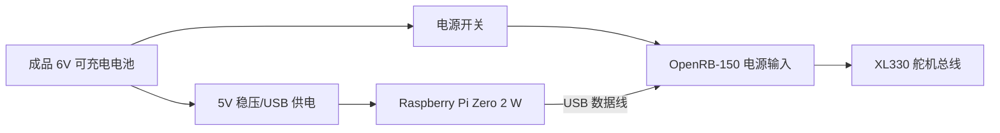
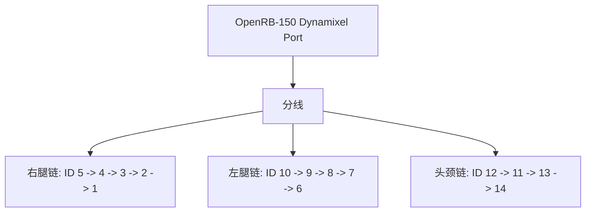
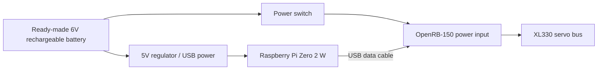

# Microduck

Microduck 是一个小型双足机器人项目，包含两部分：

- `microduck/`: Raspberry Pi Zero 2 W 上运行的部署代码，负责读取 IMU、读取手柄/键盘输入、驱动 Dynamixel 舵机，并加载 ONNX 行走策略。
- `mjlab_microduck/`: 基于 MuJoCo/MjLab 的强化学习训练环境，用来训练并导出 `walk.onnx`。

本 README 面向装机和第一次运行：准备硬件、接线、刷写 `microduck.img.xz`、初始化 Wi-Fi、SSH 登录、运行模型，以及后续更新代码。

## 致谢

感谢开源项目 [microban](https://github.com/Rhoban/microban) 和 [microduck](https://github.com/pollen-robotics/microduck)。本项目的机械结构、部署思路、仿真训练和实机行走流程都受益于这些开源工作。

## 项目状态

当前发布镜像已经内置：

- Raspberry Pi OS Lite 64-bit。
- 主机名 `microduck`。
- 默认用户 `user`。
- 部署目录 `~/microduck`。
- Python 虚拟环境 `~/microduck/.venv`。
- 行走模型 `~/microduck/src/agents/walk.onnx`。
- 无头手柄服务 `microduck-gamepad.service`，可开机后用手柄启动模型。

当前预构建镜像：

- [microduck.img.xz](https://github.com/AI-FanGe/Microduck-build-tutorial/releases/download/image.v1/microduck.img.xz)
- [microduck.img.xz.sha256](https://github.com/AI-FanGe/Microduck-build-tutorial/releases/download/image.v1/microduck.img.xz.sha256)

SHA256:

```text
096885dc32fb5b1db2ad69ba6bea868d8ab988f2b47c0d884eb63ba0dfdcb5c4
```

## BOM

下面是组装一台 Microduck 的主要物料。价格会随地区、采购渠道和批量变化，仅用于估算。

| 类别 | 物料 | 数量 | 说明 |
| :--- | :--- | :---: | :--- |
| 控制板 | Raspberry Pi Zero 2 W | 1 | 运行控制程序、蓝牙手柄、Wi-Fi 和 SSH。 |
| 舵机控制板 | ROBOTIS OpenRB-150 | 1 | 通过 USB 连接 Raspberry Pi，负责和 XL330 舵机总线通信。代码会优先自动查找 `/dev/serial/by-id/usb-ROBOTIS_OpenRB-150_*`。 |
| 舵机 | Dynamixel XL330-M288-T | 15 | 当前行走代码使用 14 个舵机：双腿 10 个，头/颈 4 个。若安装嘴部舵机，可使用 ID 15，但当前行走模型不依赖它。 |
| 电池 | 成品 6V 可充电电池 | 1 | 当前硬件直接使用成品 6V 电池包供电，不使用两节 18650 自制电池组。请确认电池能提供足够瞬时电流。 |
| 开关 | 电源开关 | 1 | 控制机器人主电源。 |
| 存储 | 32GB 或更大 microSD 卡 | 1 | 推荐使用质量稳定的新卡。镜像刷写后首次启动会自动扩展分区。 |
| IMU | BNO080/BNO085/BNO086 模块 | 1 | 通过 I2C 读取姿态，代码会自动探测常见地址。 |
| 结构件 | 3D 打印件 | 1 套 | 使用 `microduck/cad/` 中的模型打印。推荐 PLA。 |
| 螺丝 | M2/M2.5 自攻螺丝 | 若干 | 舵机固定、舵盘固定、结构件连接。建议多备。 |
| 轴承/垫片 | POM 垫片、钢垫片 | 若干 | 用作低成本转动支撑。 |
| 线材 | Dynamixel 3-pin 线、JST 线、XT30 | 若干 | 舵机串联、电源连接、分线。 |
| 调试工具 | Dynamixel U2D2 + U2D2 Power Hub | 1 套 | 用于给舵机设置 ID、波特率和参数。多人/多台机器人可共用。 |


## 舵机 ID

控制代码期望的 ID 映射如下。烧录镜像之前或第一次运行之前，应先用 Dynamixel Wizard 设置好每个舵机。

| ID | 名称 | 位置 |
| :---: | :--- | :--- |
| 1 | `right_ankle` | 右踝 |
| 2 | `right_knee` | 右膝 |
| 3 | `right_hip_pitch` | 右髋俯仰 |
| 4 | `right_hip_roll` | 右髋横滚 |
| 5 | `right_hip_yaw` | 右髋偏航 |
| 6 | `left_ankle` | 左踝 |
| 7 | `left_knee` | 左膝 |
| 8 | `left_hip_pitch` | 左髋俯仰 |
| 9 | `left_hip_roll` | 左髋横滚 |
| 10 | `left_hip_yaw` | 左髋偏航 |
| 11 | `head_pitch` | 头部俯仰 |
| 12 | `neck_pitch` | 颈部俯仰 |
| 13 | `head_yaw` | 头部偏航 |
| 14 | `head_roll` | 头部横滚 |
| 15 | `mouth` | 可选嘴部舵机，当前行走策略不使用 |

Dynamixel Wizard 推荐参数：

- Protocol: `2.0`
- Baud Rate: `1Mbps`
- Return Delay Time: `0`
- PWM Slope: `255`
- Shutdown: 去掉输入电压错误触发项，避免电池电压波动时误停

## 接线图

### 电源接线

电源链路如下：



检查要点：

- 上电前用万用表确认正负极。
- 当前硬件使用成品 6V 可充电电池，不需要自制 2S 电池组、BMS 和 2S 充电板。
- OpenRB-150 负责 XL330 舵机通信，Raspberry Pi 通过 USB 连接 OpenRB-150。
- Raspberry Pi 需要稳定 5V 供电；舵机/OpenRB-150 使用 6V 电池侧供电。两侧必须共地，具体以你的电源模块和 OpenRB-150 接法为准。
- 焊点需要热缩管或热熔胶绝缘，避免短路。

### 舵机总线

XL330 使用 3-pin 串联总线。OpenRB-150 接出后可通过分线分到左右腿和头部。



注意：

- 舵机顺序可以按结构方便布线，但 ID 必须和上表一致。
- 如果总线上有通信错误，优先检查 OpenRB-150 是否枚举成功、电池电压、GND、线序和舵机 ID。
- 正常情况下代码会自动选择 OpenRB-150 的 USB 串口；如果没有找到，会回退到 `/dev/ttyACM0`、`/dev/serial0`、`/dev/ttyAMA0` 或 `/dev/ttyS0`。

### IMU 接线

BNO08x 模块走 I2C：

| IMU 引脚 | Raspberry Pi / Hat |
| :--- | :--- |
| `VIN` / `3V3` | 3.3V，按模块标识选择 |
| `GND` | GND |
| `SDA` | GPIO2 / I2C SDA |
| `SCL` | GPIO3 / I2C SCL |

软件默认使用 I2C bus `1`，会自动寻找 BNO08x 常见地址。安装方向由 `IMU_MOUNT_QUAT` 配置，已经和当前行走模型匹配。

## 使用 `microduck.img.xz`

### 1. 校验镜像

下载或拷贝镜像后，建议先校验：

```bash
sha256sum microduck.img.xz
```

应与发布页面或上文给出的 SHA256 一致。

### 2. 刷写 SD 卡

推荐使用 Raspberry Pi Imager：

1. 插入 microSD 卡。
2. 打开 Raspberry Pi Imager。
3. `Choose Device` 选择 `Raspberry Pi Zero 2 W`。
4. `Choose OS` 选择 `Use custom`，选中 `microduck.img.xz`。
5. `Choose Storage` 选择目标 microSD 卡。
6. 如果提示是否应用 OS customization，选择 `No`。
7. 点击 `Write`，等待写入和验证完成。

Linux 命令行也可以刷写，但要非常确认设备名：

```bash
lsblk
xzcat microduck.img.xz | sudo dd of=/dev/sdX bs=4M status=progress conv=fsync
```

把 `/dev/sdX` 换成你的 SD 卡设备，不要写成电脑硬盘。

### 3. 初始化 Wi-Fi

刷写完成后，拔下再插回 SD 卡。Ubuntu 通常会挂载出两个分区：

- `bootfs`: 启动分区，可直接编辑 Wi-Fi 配置。
- `rootfs`: 系统根分区，一般不需要手动改。

编辑：

```bash
sudo nano /media/$USER/bootfs/network-config
```

内容类似：

```yaml
network:
  version: 2
  ethernets:
    eth0:
      dhcp4: true
      dhcp6: true
      optional: true
  wifis:
    wlan0:
      dhcp4: true
      regulatory-domain: "<YOUR_COUNTRY_CODE>"
      access-points:
        "<YOUR_WIFI_NAME>":
          password: "<YOUR_WIFI_PASSWORD>"
      optional: true
```

把三处占位符改掉：

- `<YOUR_COUNTRY_CODE>`: 两位国家/地区代码，例如 `CN`、`US`、`GB`、`FR`。
- `<YOUR_WIFI_NAME>`: Wi-Fi 名称。
- `<YOUR_WIFI_PASSWORD>`: Wi-Fi 密码。

Pi Zero 2 W 只支持 2.4GHz Wi-Fi。不要使用纯 5GHz 网络。

可配置多个 Wi-Fi：

```yaml
      access-points:
        "HomeWifi":
          password: "home-password"
        "PhoneHotspot":
          password: "hotspot-password"
```

保存后安全弹出 SD 卡，插入机器人，打开电源。

## 首次启动

第一次启动会做几件事：

- 扩展文件系统到整张 SD 卡。
- 重新生成 SSH host keys。
- 读取 `network-config` 并连接 Wi-Fi。
- 启动后台手柄服务。

等待 1 到 3 分钟，然后在电脑上测试：

```bash
ping microduck.local
```

如果 `.local` 解析失败，到路由器后台查看 Pi 的 IP，然后用 IP 登录。

默认登录：

```bash
ssh user@microduck.local
```

默认密码：

```text
password
```

第一次登录后建议立刻改密码：

```bash
passwd
```

## 第一次运行模型

### SSH 模式

机器人放在稳定平面上，或者手扶住，避免刚上电时摔倒。

```bash
ssh user@microduck.local
cd ~/microduck
PYTHONPATH=src .venv/bin/python src/main.py
```

启动后程序会：

1. 打开舵机扭矩。
2. 平滑回到 neutral pose。
3. 读取键盘或手柄输入。
4. 加载 `src/agents/walk.onnx` 行走策略。

键盘控制：

| 按键 | 功能 |
| :--- | :--- |
| `v` | 开启/关闭行走 |
| 方向键上/下 | 前进/后退 |
| 方向键左/右 | 左右转向 |
| `x` | 速度归零 |
| `i` | 显示/隐藏 IMU 信息 |
| `q` | 停止控制循环 |

### 从开发电脑运行

如果你在电脑上有本项目代码，配置 `~/.ssh/config`：

```sshconfig
Host microduck
    HostName microduck.local
    User user
```

然后：

```bash
cd microduck
make run
```

停止：

```bash
make stop
```

安全关机：

```bash
make shutdown
```

不要直接断电。先关机，等 10 到 15 秒，再关闭电源开关。

## 手柄模式

### 配对蓝牙手柄

SSH 到 Pi 后：

```bash
bluetoothctl
```

在 `bluetoothctl` 里执行：

```text
power on
agent on
scan on
pair XX:XX:XX:XX:XX:XX
trust XX:XX:XX:XX:XX:XX
connect XX:XX:XX:XX:XX:XX
scan off
quit
```

把 `XX:XX:XX:XX:XX:XX` 换成扫描到的手柄 MAC 地址。

### 无头运行

镜像里已经启用无头手柄服务。开机后：

| 操作 | 功能 |
| :--- | :--- |
| 按住 `START` 2 秒 | 启动控制循环 |
| `A` | 开启/关闭行走 |
| 左摇杆 | 前后/左右速度 |
| 右摇杆左右 | 原地或行进中转向 |
| `B` | 停止控制循环 |
| 同时按住左右扳机 2 秒 | 安全关机 |

手柄连接时，服务会关闭 Wi-Fi 以改善 2.4GHz 蓝牙稳定性。需要 SSH 时，先关闭手柄，Wi-Fi 会自动恢复。

## 常用命令

在开发电脑的 `microduck/` 目录下：

| 命令 | 说明 |
| :--- | :--- |
| `make sync` | 同步本地部署代码到 Pi 的 `~/microduck`。 |
| `make setup` | 同步代码并在 Pi 上执行 `uv sync --frozen`。改依赖后使用。 |
| `make run` | 同步并启动控制循环。 |
| `make stop` | 停止控制循环。 |
| `make shutdown` | 安全关闭 Pi。 |
| `make imu` | 查看 IMU/gyro 数据。 |
| `make voltage` | 查看舵机电压。 |
| `make voltage ID=2` | 查看指定舵机电压。 |
| `make gamepad-headless-enable` | 安装并启用无头手柄服务。 |
| `make gamepad-headless-disable` | 禁用无头手柄服务。 |

## 更新模型

训练仓 `mjlab_microduck/` 导出的 ONNX 模型应放到：

```bash
microduck/src/agents/walk.onnx
```

更新后同步：

```bash
cd microduck
make sync
```

下一次运行会加载新的 `walk.onnx`。

## 重新制作发布镜像

当 Pi 上的系统、依赖、服务和模型都确认可用后，可以把这张 SD 卡做成新的 `microduck.img.xz`。

推荐流程：

1. 先用当前 SD 卡实机测试 `make run` 或手柄无头运行。
2. 关机，把 SD 卡插回电脑。
3. 克隆整张卡到本地 `.img` 文件。
4. 只在镜像副本里清理敏感信息：
   - Wi-Fi 配置。
   - SSH host keys。
   - 用户 SSH key。
   - `/etc/machine-id`。
   - cloud-init 状态。
   - shell history、日志、apt 缓存。
5. 重置 `bootfs/network-config` 为占位模板。
6. 确认 `~/microduck/src/agents/walk.onnx`、`.venv`、`microduck-gamepad.service` 都存在。
7. 用 PiShrink 压缩生成 `microduck.img.xz`。
8. 计算 SHA256 并一起发布。

本仓库已有详细步骤：

```bash
microduck/docs/dev/clone_sd.md
```

## 目录结构

```text
.
├── README.md
├── microduck/
│   ├── Makefile
│   ├── src/
│   │   ├── main.py
│   │   ├── scheduler.py
│   │   ├── robot_controller.py
│   │   ├── imu_reader.py
│   │   ├── agents/walk.onnx
│   │   └── moves/walk.py
│   ├── systemd/
│   └── docs/
└── mjlab_microduck/
    ├── src/mjlab_microduck/
    └── logs/
```

## 故障排查

### 找不到 `microduck.local`

先等 1 到 3 分钟。仍找不到时：

- 确认 Wi-Fi 是 2.4GHz。
- 确认 `network-config` YAML 缩进没变。
- 到路由器后台查 Pi 的 IP。
- 用 `ssh user@<IP>` 登录。

### SSH 提示 host key changed

发布镜像首次启动会重新生成 SSH host keys。如果同一台电脑以前连过另一张卡，清理本机记录：

```bash
ssh-keygen -R microduck.local
ssh-keygen -R <IP>
```

### 舵机不动或通信错误

检查：

- 电池电压是否正常。
- OpenRB-150、舵机总线和 Raspberry Pi 供电/GND 是否正确。
- 舵机 ID 是否符合上表。
- Dynamixel 波特率是否为 1Mbps。
- OpenRB-150 的 USB 串口是否能被识别。
- 线序、分线和插头方向是否正确。

### 手柄连接后 SSH 断开

这是无头模式的设计：手柄连接后会关闭 Wi-Fi，提升蓝牙稳定性。关闭手柄后 Wi-Fi 会恢复。

### 机器人一启动就容易倒

先手扶机器人运行，确认：

- 左右腿舵机 ID 没有装反。
- 膝盖 offset 与实际装配一致。
- IMU 安装方向正确。
- `walk.onnx` 是当前硬件对应的模型。

## 安全提示

- 第一次运行一定要扶住机器人。
- 不要在桌边或高处测试。
- 不要在电池低电压时长时间运行。
- 不要直接断电，先执行 `make shutdown` 或手柄安全关机。
- 充电和上电前检查短路、极性和焊点绝缘。

---

# Microduck (English)

Microduck is a compact biped robot project. This repository presents one practical hardware and software setup for running an ONNX reinforcement learning walking policy on real Dynamixel XL330 servos.

The project contains two main parts:

- `microduck/`: deployment code for the Raspberry Pi Zero 2 W. It reads the IMU, reads keyboard or gamepad commands, drives Dynamixel servos, and loads the ONNX walking policy.
- `mjlab_microduck/`: reinforcement learning training environment based on MuJoCo/MjLab. It is used to train and export `walk.onnx`.

This README covers the full first-time workflow: hardware, wiring, flashing `microduck.img.xz`, Wi-Fi setup, first SSH login, first run, day-to-day usage, and rebuilding a release image.

## Acknowledgements

Thanks to the open-source projects [microban](https://github.com/Rhoban/microban) and [microduck](https://github.com/pollen-robotics/microduck). This project benefits from their mechanical design, deployment ideas, simulation training work, and real-robot walking pipeline.

## Project Status

The current release image includes:

- Raspberry Pi OS Lite 64-bit.
- Hostname `microduck`.
- Default user `user`.
- Deployment directory `~/microduck`.
- Python virtual environment `~/microduck/.venv`.
- Walking model `~/microduck/src/agents/walk.onnx`.
- Headless gamepad service `microduck-gamepad.service`, so the walking controller can be started from a gamepad after boot.

Current prebuilt image:

- [microduck.img.xz](https://github.com/AI-FanGe/Microduck-build-tutorial/releases/download/image.v1/microduck.img.xz)
- [microduck.img.xz.sha256](https://github.com/AI-FanGe/Microduck-build-tutorial/releases/download/image.v1/microduck.img.xz.sha256)

SHA256:

```text
096885dc32fb5b1db2ad69ba6bea868d8ab988f2b47c0d884eb63ba0dfdcb5c4
```

## BOM

The following is the main bill of materials for building one Microduck. Prices vary by region, supplier, and quantity, so treat them as estimates.

| Category | Part | Qty | Notes |
| :--- | :--- | :---: | :--- |
| Main controller | Raspberry Pi Zero 2 W | 1 | Runs the control program, Bluetooth gamepad, Wi-Fi, and SSH. |
| Servo controller | ROBOTIS OpenRB-150 | 1 | Connected to the Raspberry Pi over USB. It communicates with the XL330 servo bus. The code first looks for `/dev/serial/by-id/usb-ROBOTIS_OpenRB-150_*`. |
| Servos | Dynamixel XL330-M288-T | 14 | The current walking code uses 14 servos: 10 for the legs and 4 for the head/neck. An optional mouth servo can use ID 15, but the walking policy does not depend on it. |
| Battery | Ready-made 6V rechargeable battery | 1 | This hardware setup uses a ready-made 6V battery pack, not a custom two-cell pack. Make sure the battery can provide enough peak current. |
| Switch | Power switch | 1 | Main power switch for the robot. |
| Storage | 16GB or larger microSD card | 1 | Use a reliable new card. The image expands the filesystem on first boot. |
| IMU | BNO080/BNO085/BNO086 module | 1 | Read over I2C. The code auto-detects common BNO08x addresses. |
| Mechanical parts | 3D-printed parts | 1 set | Print from the models under `microduck/cad/`. PLA is recommended. |
| Screws | M2/M2.5 self-tapping screws | Several | Used for servo mounting, horn mounting, and structural assembly. Keep extras. |
| Bearings/shims | POM shims and steel shims | Several | Low-cost rotational support. |
| Cables | Dynamixel 3-pin cables, JST wires, power connectors | Several | Servo daisy chains, power wiring, and splitters. |
| Setup tools | Dynamixel U2D2 + U2D2 Power Hub | 1 set | Used to configure servo IDs, baud rate, and parameters. One set can be shared across multiple robots. |

Recommended extras:

- Spare XL330 servos, spare 6V battery, power wires, and Dynamixel cables.
- JST-EH terminals, crimping tool, heat-shrink tubing, and hot glue.
- A multimeter for checking polarity and battery voltage.

## Servo IDs

The deployment code expects the following ID mapping. Configure every servo with Dynamixel Wizard before the first run.

| ID | Name | Position |
| :---: | :--- | :--- |
| 1 | `right_ankle` | Right ankle |
| 2 | `right_knee` | Right knee |
| 3 | `right_hip_pitch` | Right hip pitch |
| 4 | `right_hip_roll` | Right hip roll |
| 5 | `right_hip_yaw` | Right hip yaw |
| 6 | `left_ankle` | Left ankle |
| 7 | `left_knee` | Left knee |
| 8 | `left_hip_pitch` | Left hip pitch |
| 9 | `left_hip_roll` | Left hip roll |
| 10 | `left_hip_yaw` | Left hip yaw |
| 11 | `head_pitch` | Head pitch |
| 12 | `neck_pitch` | Neck pitch |
| 13 | `head_yaw` | Head yaw |
| 14 | `head_roll` | Head roll |
| 15 | `mouth` | Optional mouth servo, not used by the current walking policy |

Recommended Dynamixel Wizard settings:

- Protocol: `2.0`
- Baud Rate: `1Mbps`
- Return Delay Time: `0`
- PWM Slope: `255`
- Shutdown: remove the input-voltage-error trigger to avoid unwanted shutdowns during battery voltage dips

## Wiring

### Power Wiring

The power path is:



Checklist:

- Check polarity with a multimeter before powering on.
- This setup uses a ready-made 6V rechargeable battery. It does not require a custom two-cell battery pack, BMS, or 2S charger board.
- OpenRB-150 handles XL330 servo communication. The Raspberry Pi connects to it over USB.
- The Raspberry Pi needs stable 5V power. The servos/OpenRB-150 are powered from the 6V battery side. Grounds must be common. Follow your actual regulator and OpenRB-150 wiring.
- Insulate solder joints with heat-shrink tubing or hot glue to prevent shorts.

### Servo Bus

XL330 servos use a 3-pin daisy-chain bus. The OpenRB-150 output can be split into the right leg, left leg, and head/neck chains.


Notes:

- The physical cable order can follow the mechanical layout, but the servo IDs must match the table above.
- If the bus has communication errors, first check that the OpenRB-150 enumerates correctly, then check battery voltage, ground, cable order, and servo IDs.
- Normally the code automatically selects the OpenRB-150 USB serial port. If not found, it falls back to `/dev/ttyACM0`, `/dev/serial0`, `/dev/ttyAMA0`, or `/dev/ttyS0`.

### IMU Wiring

The BNO08x module uses I2C:

| IMU Pin | Raspberry Pi / Hat |
| :--- | :--- |
| `VIN` / `3V3` | 3.3V, depending on the module label |
| `GND` | GND |
| `SDA` | GPIO2 / I2C SDA |
| `SCL` | GPIO3 / I2C SCL |

The software uses I2C bus `1` by default and auto-detects common BNO08x addresses. The mounting orientation is configured by `IMU_MOUNT_QUAT`, which is already matched to the current walking model.

## Using `microduck.img.xz`

### 1. Verify the Image

After downloading or copying the image, verify it:

```bash
sha256sum microduck.img.xz
```

The result should match the SHA256 published with the image.

### 2. Flash the SD Card

Raspberry Pi Imager is recommended:

1. Insert the microSD card.
2. Open Raspberry Pi Imager.
3. Select `Choose Device` -> `Raspberry Pi Zero 2 W`.
4. Select `Choose OS` -> `Use custom`, then choose `microduck.img.xz`.
5. Select `Choose Storage`, then choose the target microSD card.
6. If asked whether to apply OS customization settings, choose `No`.
7. Click `Write` and wait for writing and verification to complete.

You can also flash from the Linux command line. Be very careful with the device name:

```bash
lsblk
xzcat microduck.img.xz | sudo dd of=/dev/sdX bs=4M status=progress conv=fsync
```

Replace `/dev/sdX` with your SD card device. Do not write to your computer's internal disk.

### 3. Initialize Wi-Fi

After flashing, unplug and reinsert the SD card. Ubuntu usually mounts two partitions:

- `bootfs`: boot partition, where Wi-Fi can be configured.
- `rootfs`: root filesystem, usually no manual edits are needed.

Edit:

```bash
sudo nano /media/$USER/bootfs/network-config
```

The file looks like this:

```yaml
network:
  version: 2
  ethernets:
    eth0:
      dhcp4: true
      dhcp6: true
      optional: true
  wifis:
    wlan0:
      dhcp4: true
      regulatory-domain: "<YOUR_COUNTRY_CODE>"
      access-points:
        "<YOUR_WIFI_NAME>":
          password: "<YOUR_WIFI_PASSWORD>"
      optional: true
```

Replace:

- `<YOUR_COUNTRY_CODE>`: two-letter country code, such as `CN`, `US`, `GB`, or `FR`.
- `<YOUR_WIFI_NAME>`: Wi-Fi name.
- `<YOUR_WIFI_PASSWORD>`: Wi-Fi password.

The Raspberry Pi Zero 2 W only supports 2.4GHz Wi-Fi. Do not use a 5GHz-only network.

Multiple Wi-Fi networks can be configured:

```yaml
      access-points:
        "HomeWifi":
          password: "home-password"
        "PhoneHotspot":
          password: "hotspot-password"
```

Save the file, safely eject the SD card, insert it into the robot, and power on.

## First Boot

On first boot, the image will:

- Expand the filesystem to the full SD card.
- Regenerate SSH host keys.
- Read `network-config` and join Wi-Fi.
- Start the background gamepad service.

Wait 1 to 3 minutes, then test from your computer:

```bash
ping microduck.local
```

If `.local` does not resolve, check your router's DHCP client list and use the Pi's IP address.

Default login:

```bash
ssh user@microduck.local
```

Default password:

```text
password
```

Change the password after the first login:

```bash
passwd
```

## First Run

### SSH Mode

Place the robot on a stable surface, or hold it securely to prevent falls.

```bash
ssh user@microduck.local
cd ~/microduck
PYTHONPATH=src .venv/bin/python src/main.py
```

On startup, the program will:

1. Enable servo torque.
2. Smoothly move to the neutral pose.
3. Read keyboard or gamepad input.
4. Load `src/agents/walk.onnx`.

Keyboard controls:

| Key | Action |
| :--- | :--- |
| `v` | Toggle walking |
| Up/down arrows | Forward/backward |
| Left/right arrows | Turn left/right |
| `x` | Zero velocity |
| `i` | Show/hide IMU status |
| `q` | Stop the control loop |

### Running from a Development Computer

If the project is also on your development computer, add this to `~/.ssh/config`:

```sshconfig
Host microduck
    HostName microduck.local
    User user
```

Then run:

```bash
cd microduck
make run
```

Stop:

```bash
make stop
```

Safe shutdown:

```bash
make shutdown
```

Do not cut power directly. Shut the Pi down first, wait 10 to 15 seconds, then turn off the power switch.

## Gamepad Mode

### Pair a Bluetooth Gamepad

SSH into the Pi, then run:

```bash
bluetoothctl
```

Inside `bluetoothctl`:

```text
power on
agent on
scan on
pair XX:XX:XX:XX:XX:XX
trust XX:XX:XX:XX:XX:XX
connect XX:XX:XX:XX:XX:XX
scan off
quit
```

Replace `XX:XX:XX:XX:XX:XX` with the detected controller MAC address.

### Headless Operation

The image already enables the headless gamepad service. After boot:

| Action | Function |
| :--- | :--- |
| Hold `START` for 2 seconds | Start the control loop |
| `A` | Toggle walking |
| Left stick | Forward/backward and lateral velocity |
| Right stick left/right | Turning |
| `B` | Stop the control loop |
| Hold both triggers for 2 seconds | Safe shutdown |

When the gamepad is connected, the service disables Wi-Fi to improve 2.4GHz Bluetooth stability. Turn off the controller when you need SSH; Wi-Fi will be restored automatically.

## Common Commands

Run these from the `microduck/` directory on your development computer:

| Command | Description |
| :--- | :--- |
| `make sync` | Sync local deployment code to `~/microduck` on the Pi. |
| `make setup` | Sync code and run `uv sync --frozen` on the Pi. Use after dependency changes. |
| `make run` | Sync and start the control loop. |
| `make stop` | Stop the control loop. |
| `make shutdown` | Safely shut down the Pi. |
| `make imu` | Print IMU/gyro data. |
| `make voltage` | Read servo voltage. |
| `make voltage ID=2` | Read voltage from a specific servo. |
| `make gamepad-headless-enable` | Install and enable the headless gamepad service. |
| `make gamepad-headless-disable` | Disable the headless gamepad service. |

## Updating the Model

The ONNX model exported from `mjlab_microduck/` should be placed at:

```bash
microduck/src/agents/walk.onnx
```

Then sync:

```bash
cd microduck
make sync
```

The next run will load the new `walk.onnx`.

## Rebuilding a Release Image

After the Pi system, dependencies, services, and model have been tested, the SD card can be turned into a new `microduck.img.xz`.

Recommended workflow:

1. Test `make run` or headless gamepad mode on the real robot.
2. Shut down the Pi and insert the SD card into your computer.
3. Clone the full card to a local `.img` file.
4. Clean sensitive information only inside the cloned image:
   - Wi-Fi credentials.
   - SSH host keys.
   - User SSH keys.
   - `/etc/machine-id`.
   - cloud-init state.
   - shell history, logs, and apt cache.
5. Reset `bootfs/network-config` to placeholder values.
6. Verify that `~/microduck/src/agents/walk.onnx`, `.venv`, and `microduck-gamepad.service` exist.
7. Use PiShrink to create `microduck.img.xz`.
8. Compute SHA256 and publish it with the image.

Detailed steps are in:

```bash
microduck/docs/dev/clone_sd.md
```

## Directory Layout

```text
.
├── README.md
├── microduck/
│   ├── Makefile
│   ├── src/
│   │   ├── main.py
│   │   ├── scheduler.py
│   │   ├── robot_controller.py
│   │   ├── imu_reader.py
│   │   ├── agents/walk.onnx
│   │   └── moves/walk.py
│   ├── systemd/
│   └── docs/
└── mjlab_microduck/
    ├── src/mjlab_microduck/
    └── logs/
```

## Troubleshooting

### `microduck.local` Cannot Be Found

Wait 1 to 3 minutes first. If it still cannot be found:

- Make sure the Wi-Fi is 2.4GHz.
- Make sure the YAML indentation in `network-config` is unchanged.
- Check the Pi's IP address in your router.
- Login with `ssh user@<IP>`.

### SSH Says Host Key Changed

The release image regenerates SSH host keys on first boot. If your computer previously connected to another card, clear the local entry:

```bash
ssh-keygen -R microduck.local
ssh-keygen -R <IP>
```

### Servos Do Not Move or Communication Fails

Check:

- Battery voltage.
- OpenRB-150, servo bus, Raspberry Pi power, and common ground.
- Servo IDs match the table above.
- Dynamixel baud rate is 1Mbps.
- OpenRB-150 USB serial port is detected.
- Cable order, splitters, and connector direction.

### SSH Disconnects When the Gamepad Connects

This is expected in headless mode. The service disables Wi-Fi when the gamepad is connected to improve Bluetooth stability. Turn off the controller and Wi-Fi will be restored.

### The Robot Falls Immediately

Hold the robot first, then check:

- Left/right leg servo IDs are not swapped.
- Knee offsets match the physical assembly.
- IMU mounting orientation is correct.
- `walk.onnx` matches the current hardware.

## Safety Notes

- Hold the robot during the first run.
- Do not test near the edge of a table.
- Do not run for a long time on low battery.
- Do not cut power directly. Use `make shutdown` or the gamepad shutdown gesture first.
- Before charging or powering on, check for shorts, polarity, and insulation.
